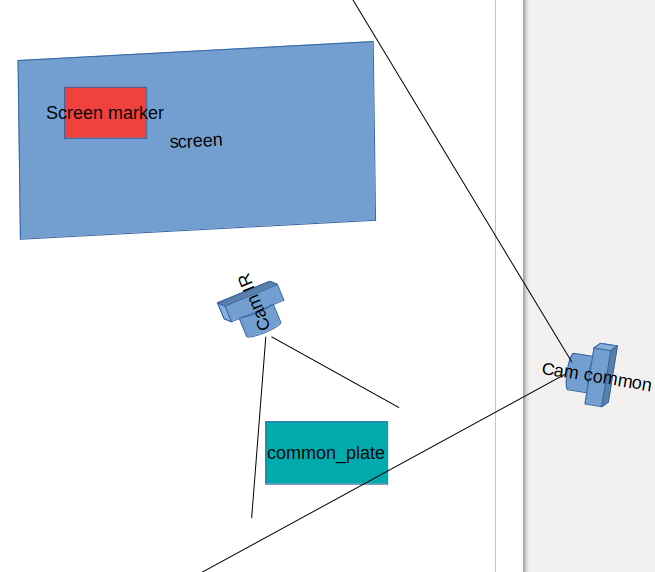

# 背景

这里是相机常用的一些代码

# Features
- [ ] 相机镜头标定
- [ ] 屏幕坐标向相机坐标转换程序

# 安装

# 使用

- 相机镜头标定
```
python3 cam_calibration/calibrate_wide_angle_camera.py --input cam_calibration/data/chessboard.avi
```
- 屏幕坐标到相机坐标的转换
```
python3 cam_calibration/gen_to_cam_matrix.py 
```
corners_2d_rgb 为rgb相机下屏幕和标定板的角点坐标
corners_3d_rgb 为对应角点三维坐标

# 多相机标定
## 问题描述
如下图所示， IR camera位于屏幕（screen）和common_plate之间， IR相机是可以看到common_plate的， 可以通过标定得到common_plate在IR camera的相机坐标系下的坐标， 但是现在需要知道屏幕（screen）上任意一点在IR camera的相机坐标系下的坐标。

## 解决方法
引入第二个相机 cam common， 这个相机能够同时拍摄到screen和common_plate，通过cam common作为中介，能够获取screen到IR cam相机坐标系的转换矩阵。步骤如下：
1. IR camera和common cam通过棋盘格标定出相机内参。
2. 在screen上定义一个方便观察的marker，比如一张A4纸，common_plate可以设置为一个尺寸固定的棋盘格。记录marker和common plate的分别四个角点的坐标
